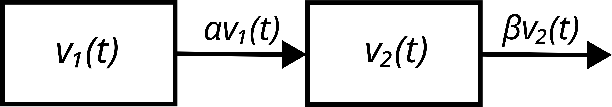
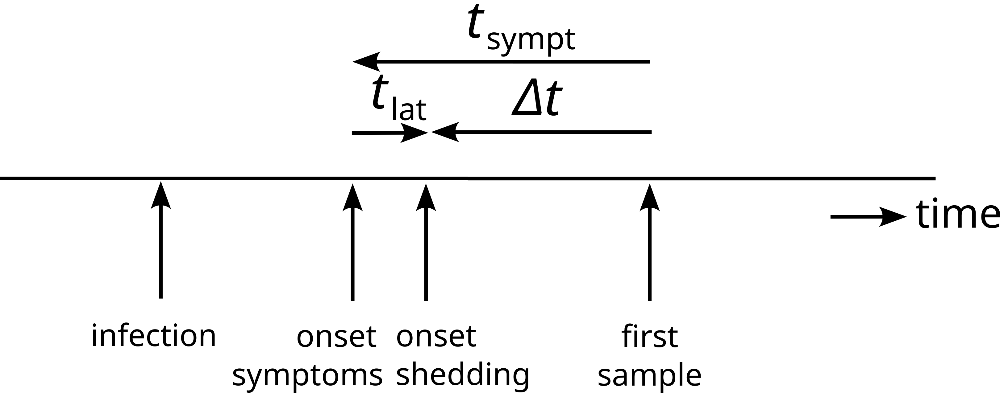
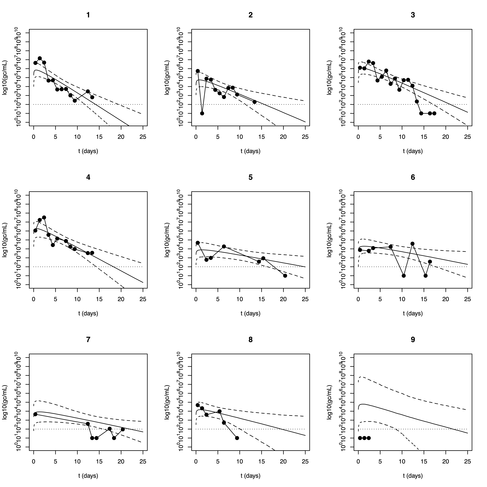
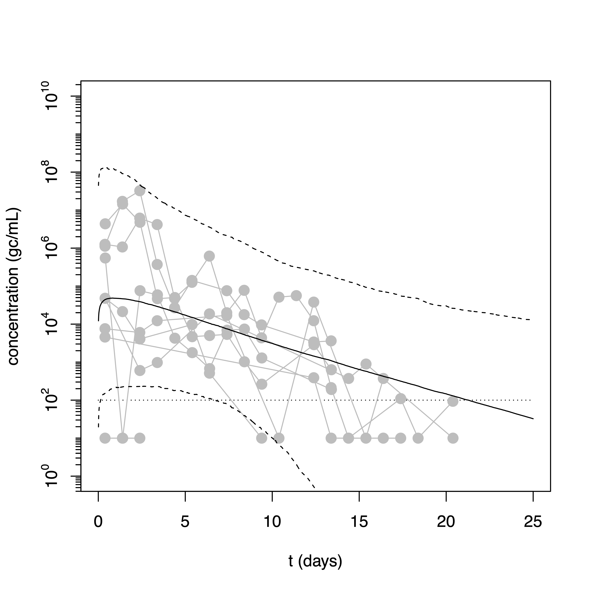
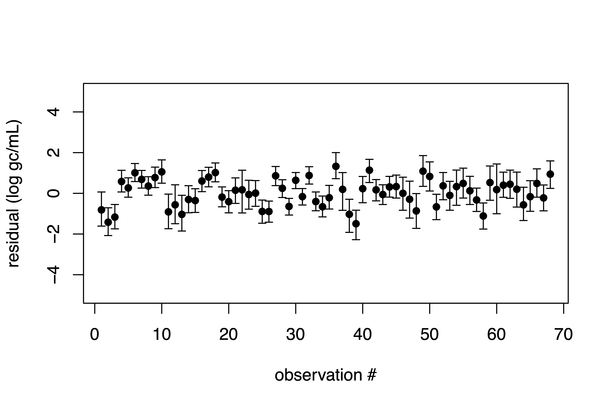

# Time Course of Fecal Shedding
Peter Teunis, Center for Global Safe WASH, Rollins School of Public Health, Emory University

2024-11-07

## 1. Model for the Time Course of Virus Fecal Shedding

A realistic model of the time course of virus shedding must include an
initial increase in virus concentration, followed by a decrease to
undetectable levels.

Suppose virus is accumulated at an infection site and released into the
intestinal tract with concentration $v_{1}(t)$, where it is transported
with peristalsis, to ultimately be excreted.

<figure class="image">
  
  <figcaption>

  Figure 1. Virus present at an infection site is transported to the intestines with rate $\alpha$ from where it is shedded with a rate $\beta$.

  </figcaption>
</figure>

The concentration $v_{2}(t)$ of virus leaving the intestines then can be
described as resulting from

```math
\begin{align}
\bigg\lbrace
\begin{array}{ll}
v_{1}^{\prime}(t) = -\alpha v_{1}(t); & v_{1}(0) = A\\
v_{2}^{\prime}(t) = +\alpha v_{1}(t) - \beta v_{2}(t); & v_{2}(0) = 0\\
\end{array}
\end{align}
```

where $A$ is the initial concentration of virus at the primary infection
site, $\alpha$ and $\beta$ are constants defined by the transport rate
and effective volumes of the compartments within the intestinal tract
([Teunis, 1994](https://rivm.openrepository.com/handle/10029/9967)). The solution

$$
\begin{align}
\bigg\lbrace
\begin{array}{ll}
v_{1}(t) = A\text{e}^{-\alpha t} & \\
v_{2}(t) = \frac{\alpha}{\beta -\alpha}A\text{e}^{-\alpha t}
 \left(1-\text{e}^{-(\beta-\alpha)t}\right) & \\
\end{array}
\end{align}
$$

is realistic for $\alpha >0$ and $\beta > \alpha$.

The observed fecal virus concentration can then be written as

$$
\begin{align}
v(t \vert \alpha, \gamma ) = v_{0}\text{e}^{-\alpha t}(1-\text{e}^{-\gamma t}),
\quad where \enspace \alpha > 0, \enspace \gamma > 0
\end{align}
$$

At onset of shedding ($t=0$) the virus concentration $v(t)$ increases
from $0$ (with rate $v_{0}\gamma$), reaches a maximum

$$v_{1} = v_{0}\frac{\gamma}{\alpha +\gamma}
 \left(\frac{\alpha}{\alpha +\gamma}\right)^{\frac{\alpha}{\gamma}}$$ 

at time

$$t_{1} = \frac{1}{\gamma} \log\left(\frac{\alpha +\gamma}{\alpha}\right)$$

and then decreases to $0$ again (with rate $v_{0}\alpha$).

If the constant $v_{0}$ is defined as

$$
\begin{align}
 v_{0} = \frac{\alpha +\gamma}{\gamma}
 \left(\frac{\alpha +\gamma}{\alpha}\right)^{\frac{\alpha}{\gamma}}
\end{align}
$$

then the peak virus concentration is $v_{1} = 1$. When virus
concentrations are measured on a log scale the regression model is

$$
\begin{align}
u(t \vert \alpha, \gamma, c, d) = c + d \log(v(t \vert \alpha, \gamma ))
\end{align}
$$

with scale factor $d$ and offset $c$.

## 2. Model Fitting

### 2.1 Likelihood Function

The above model can be fitted to observed values (log concentrations of
virus in fecal samples of infected individuals) by assuming observations
have a normally distributed measurement error with expected value $u$
and standard deviation $\sigma$ (or precision $\tau = 1/\sigma^{2}$).

Suppose a subject $n$ has a set of observed log concentrations

$$
\boldsymbol{U}\_{n} = (U\_{n,1}, U\_{n,2},\dots, U\_{n,K\_{n}})
$$ 

at times since infection onset

$$
\boldsymbol{T}\_{n} = (T\_{n,1}, T\_{n,2},\dots, T\_{n,K\_{n}})
$$

The likelihood of the model for this subject then becomes

$$
\begin{align}
\ell_{n} = \prod_{k=1}^{K_{n}}\phi(U_{n,k}\vert
  u(T_{n,k},\alpha_{n}, \gamma_{n}, c_{n}, d_{n}),\tau)
\end{align}
$$

where $\phi(\mu,\tau)$ is the normal probability density with mean $\mu$ and
precision $\tau$ (standard deviation $\sigma = 1/\sqrt{\tau}$).

Note that accounting for censored observations is straightforward: in
case of a lower limit of detection $u_{\text{min}}$ the contribution (of
observation $k$ from subject $n$) to the likelihood is

$$\Phi(u_{\text{min}}\vert u(T_{n,k},\alpha_{n},\gamma_{n},c_{n},d_{n}),\tau)$$

where $\Phi()$ is the cumulative probability

$$\Phi(u\vert \mu,\tau) = \int_{-\infty}^{u}\phi(u\vert \mu,\tau)$$

### 2.2 Missing Onset

The onset of shedding, $t=0$ in equation (3), cannot be observed. For symptomatic
subjects the onset of symptoms may be assumed to occur shortly after the
onset of shedding ([Sukhire et al., 2012](https://academic.oup.com/cid/article-abstract/54/7/931/299160?redirectedFrom=fulltext&login=false)). For asymptomatic subjects
the onset of symptoms (onset of virus shedding) is usually missing.

When there are observations of the shedding response an estimate of the
onset of shedding may be found by shifting the origin of the time axis
until optimum agreement between the observed virus concentrations and
the curve predicted by equation (3).

<figure class="image">
  
  <figcaption>

  Figure 2. Timing of events relevant for finding the onset of the shedding response. When a subject is infected tissues in the intestinal tract become colonized by virus and after a few days symptoms of acute illness may develop. Virus may also be shed in feces, not necessarily at the same time as the appearance of symptoms. Some latency $t_{\text{lat}}$ may exist between onsets of shedding and symptoms. Note that $t_{\text{lat}}$ may be positve or negative, depending on the within-host dynamics of the infection. Usually the first sample is taken a bit later: the delay between onset of shedding and date of first sample is $\Delta t$.

  </figcaption>
</figure>

It is convenient to take the time of the first sample as reference (as
it is always present) and express onset of shedding as the time
$\Delta t$ from the first sample (Figure 2).

$$
\begin{align}
u(t + \Delta t \vert \alpha, \gamma, c, d) = 
  c - d \log(v(t + \Delta t \vert \alpha, \gamma ))
\end{align}
$$

For symptomatic cases the onset of symptoms may be known. The onset of
shedding may not coincide with symptom onset but the difference can be
considered smaller than $\Delta t$ ($t_{\text{lat}}$ in Figure 2).

As long as observed log concentrations $U_{n,k}$ are present, $\Delta t$
can be estimated using the likelihood

$$
\begin{align}
\ell_{n} = \prod_{k=1}^{K_{n}}\phi(U_{n,k}\vert
u(T_{n,k}+\Delta t_{n},\alpha_{n}, \gamma_{n}, c_{n}, d_{n}),\tau)
\psi(\Delta t_{n})
\end{align}
$$

where $\Delta t_{n}$ is the offset between first
sample and onset of shedding (for subject $n$) with probability density
$\psi()$. It is possible to facilitate estimation of $\Delta t$ in case
any additional information on the times of infection and the
distribution of the latency (of symptoms or shedding) by defining
appropriate prior distributions.

### 2.3 Mixed Model

Each infected subject may be assumed to have their own unique shedding
response, so that the parameter vector
$\boldsymbol{\theta} = \log(\alpha, \gamma, c, d)$ varies among shedding
individuals. The log transform is used here because all parameters must
be positive.

In a Bayesian framework the variation of these parameters in the study
population can be described by their joint probability distribution

$$
\begin{align}
\boldsymbol{\theta} = \log(\alpha, \gamma, c, d) \sim
  N(\boldsymbol{\mu}\_{\theta},\boldsymbol{\tau}\_{\theta})
\end{align}
$$

where $N(\boldsymbol{\mu}\_{\theta},\boldsymbol{\tau}\_{\theta})$ is a
multinormal distribution with mean vector
$\boldsymbol{\mu}\_{\theta} = (\mu\_{\alpha}, \mu\_{\gamma}, \mu\_{c},
\mu\_{d})$ and precision matrix $\boldsymbol{\tau}\_{\theta}$.

Figure 3 shows the structure of the Bayesian model in a directed acyclic graph.

<figure class="image">
  
  <figcaption>

  Figure 3. Directed acyclic graph of the shedding model. For subject $n$ ($n = 1, 2, \dots, N$) sample $k$ ($k = 1,2,\dots, K_{n}$) has log concentrations $U_{n,k}$ observed at times $T_{n,k}$. Log concentrations are measured with precision $\tau_{\text{obs}}$. The shedding response $u(t + \Delta t, \boldsymbol{\theta})$ has parameters $\boldsymbol{\theta}\_{n} = (\alpha\_{n}, \gamma\_{n}, c\_{n}, d\_{n})$ with joint normal distribution, mean $\boldsymbol{\mu}\_{\theta}$, precision matrix $\boldsymbol{\tau}\_{\theta}$. The offset $\Delta t_{n}$ between time of first sample $T_{n,1}$ and onset of shedding has its own (normal) distribution (mean $\mu_{\Delta t}$ and precision $\tau_{\Delta t}$).

  </figcaption>
</figure>

### 2.4 Implementation in JAGS

The source code for the corresponding JAGS model

Equation (5) can be translated into

```
u[subj,obs] <- c[subj] + d[subj]*log(exp(-alpha[subj]*t[subj,obs])*
        (1-exp(-gamma[subj]*t[subj,obs]))*v0[subj])
```

where `subj` and `obs` refer to a subject ($n = 1,\dots , N$) and the
observation for that subject ($k = 1,\dots,K_{n}$). The normalizing
factor `v0[subj]` as defined in equation (4) is

```
v0[subj] <- ((alpha[subj]+gamma[subj])/gamma[subj])*
        ((alpha[subj]+gamma[subj])/alpha[subj])^(alpha[subj]/gamma[subj])
```

To calculate the time between the first sample and onset of shedding
`offs.shed` = $\Delta t$ (Figure 2), first a distribution is defined for the time from first sample to symptom onset `offs.sympt` = $t_{\text{sympt}}$.

```
offs.sympt[subj] ~ dnorm(mu.offs,tau.offs)
```

Then the time from symptom onset to start of shedding, $t_{\text{lat}}$, is assumed to follow a lognormal distribution. `loglat` = $\log(t_{\text{lat}})$.

```
loglat[subj] ~ dnorm(mu.loglat,tau.loglat)
```

now $\Delta t$ = `offs.shed` may be calculated

```
offs.shed[subj] <- offs.sympt[subj]-exp(loglat[subj])
```

The time from the start of shedding as used in Equation (5) can
now be calculated by correcting the time of the sample `t.obs[subj,obs]`

```
t[subj,obs] <- t.obs[subj,obs]-offs.shed[subj]
```

Now take the observed log concentrations of virus $U_{n,k}$ or
`log.obs[subj,obs]` that are assumed normally distributed with expected
value $u(T_{n,k},\boldsymbol{\theta}_n)$ = `u[subj,obs]` and precision
$\tau$ = `tau.obs`

```
logv.obs[subj,obs] ~ dnorm(u[subj,obs],tau.obs)
```

Censored observations require different treatment. In JAGS the
`dinterval` distribution can be used. Here for LLOD (lower detection
limit) an indicator variable must be supplied `v.cens` = 1 for observed
virus concentrations above detection limit and 0 for observations below
the detection limit. The detection limit is $U_{\text{lim}}$ =
`logcenslim`.

```
v.cens[subj,obs] ~ dinterval(logv.obs[subj,obs],logcenslim)
```

When sample $k$ in subject $n$ returns a virus concentration
$U_{n,k} \ge U_{\text{lim}}$ then\
`v.cens[subj,obs]` = 1 and `logv.obs` = $U_{n,k}$. In case sample $k$ in
subject $n$ returns a virus concentration $U_{n,k} < U_{\text{lim}}$
then `v.cens[subj,obs]` = 0 and `logv.obs` = NA: because it is missing a
`logv.obs` $< U_{\text{lim}}$ is then generated.

Remains a specification of the priors for the parameters of the shedding
model. First, the 4 parameters $\alpha, \gamma, c, d$ are collected (and
log transformed) into a vector $\boldsymbol{\theta}$ and a multinormal
distribution is defined

```
alpha[subj] <- exp(theta[subj,1])
gamma[subj] <- exp(theta[subj,2])
c[subj]     <- exp(theta[subj,3])
d[subj]     <- exp(theta[subj,4])
theta[subj,1:4] ~ dmnorm(mu.theta,tau.theta)
```

Then priors are defined: a multinormal distribution for the mean vector
$\boldsymbol{\mu}\_{\theta}$= `mu.theta` and a Wishart distribution for
the precision matrix $\boldsymbol{\tau}\_{\theta}$ = `tau.theta`.
Finally, the precision $\tau_{\text{obs}}$ = `tau.obs`for measurement
error of log virus concentrations gets a gamma ditributed prior.

```
mu.theta ~ dmnorm(mu.hyp,tau.hyp)
tau.theta ~ dwish(omega,df)
tau.obs ~ dgamma(tau.obs.hyp[1],tau.obs.hyp[2])
```

The only thing left now is to define loops for the indices $n$ = `subj`
and $k$ = `obs`.

Below is the complete model code again:

```
model{
    for(subj in 1:n.subj) {
        v0[subj] <- ((alpha[subj]+gamma[subj])/gamma[subj])*
                    ((alpha[subj]+gamma[subj])/alpha[subj])^(alpha[subj]/gamma[subj])
        offs.sympt[subj] ~ dnorm(mu.offs,tau.offs)
        loglat[subj] ~ dnorm(mu.loglat,tau.loglat)
        offs.shed[subj] <- offs.sympt[subj]-exp(loglat[subj])
        for(obs in 1:n.obs[subj]) {
            t[subj,obs] <- t.obs[subj,obs]-offs.shed[subj]
            u[subj,obs] <- c[subj] + d[subj]*
                log(exp(-alpha[subj]*t[subj,obs])*(1-exp(-gamma[subj]*t[subj,obs]))*v0[subj])
            v.cens[subj,obs] ~ dinterval(logv.obs[subj,obs],logcenslim)
            logv.obs[subj,obs] ~ dnorm(u[subj,obs],tau.obs)
        }
        alpha[subj] <- exp(theta[subj,1])
        gamma[subj] <- exp(theta[subj,2])
        c[subj]     <- exp(theta[subj,3])
        d[subj]     <- exp(theta[subj,4])
        theta[subj,1:4] ~ dmnorm(mu.theta,tau.theta)
    }
    mu.theta ~ dmnorm(mu.hyp,tau.hyp)
    tau.theta ~ dwish(omega,df)
    tau.obs ~ dgamma(tau.obs.hyp[1],tau.obs.hyp[2])
}
```

## 3. Case Study using R

### 3.1 Data and Constants

We use the longitudinal SARS-CoV-2 fecal shedding data from [Wölfel et al. (2020)](https://www.nature.com/articles/s41586-020-2196-x). The data includes observations of SARS-CoV-2 RNA concentration in 82 stool samples from 9 patients. The date of sample collection spans from Day 3 to Day 22 after symptom onset. We load the data in R with:

```r
shedding.data <- data.frame(subjects = c(1, 1, 1, 1, 1, 1, 1, 1, 1, 1, 1, 1, 2, 2, 2, 2, 2, 2, 2, 2, 2, 2, 2, 3, 3, 3, 3, 3, 3, 3, 3, 3, 3, 3, 3, 3, 3, 3, 3, 3, 4, 4, 4, 4, 4, 4, 4, 4, 4, 4, 4, 5, 5, 5, 5, 5, 5, 5, 6, 6, 6, 6, 6, 6, 6, 6, 7, 7, 7, 7, 7, 7, 7, 8, 8, 8, 8, 8, 8, 9, 9, 9), 
                            day = c(8, 9, 10, 11, 12, 13, 14, 15, 16, 17, 20, 21, 6, 7, 8, 9, 10, 11, 12, 13, 14, 15, 19, 6, 7, 8, 9, 10, 11, 12, 13, 14, 15, 16, 17, 18, 19, 20, 22, 23, 7, 8, 9, 10, 11, 12, 14, 15, 16, 19, 20, 6, 8, 9, 12, 20, 21, 26, 6, 8, 9, 13, 16, 18, 21, 22, 6, 18, 19, 20, 23, 24, 26, 3, 4, 5, 8, 9, 12, 8, 9, 10),
                            value = 10^c(6.64, 7.16, 6.68, 4.67, 4.7, 3.67, 3.7, 3.73, 3.01, 2.42, 3.46, 2.8, 5.74, NA, 4.88, 4.77, 3.63, 3.25, 2.83, 3.84, 3.87, 3.11, 2.28, 6.1, 6.03, 6.79, 6.62, 4.68, 5.1, 5.79, 4.3, 4.89, 3.64, 4.71, 4.75, 4.09, 2.33, NA, NA, NA, 6.05, 7.23, 7.51, 5.57, 4.43, 5.15, 4.88, 4.25, 3.98, 3.53, 3.56, 4.68, 2.78, 2.99, 4.27, 2.57, 2.95, NA, 3.88, 3.78, 4.09, 4.23, NA, 4.58, NA, 2.57, 3.66, 2.59, NA, NA, 2.04, NA, 1.97, 4.68, 4.33, 3.61, 3.99, 2.71, NA, NA, NA, NA))
```

When there are samples from $N$ subjects with up to $K$ observations per
subject then the following data are needed:

-   Observation times (from first sample) `t.obs`: $N\times K$ matrix

-   Log virus concentrations `logv.obs`: $N\times K$ matrix

-   Censoring indicator `v.cens`: $N\times K$ matrix

-   Times from symptom onset (re first sample) `offs.sympt`: vector size
    $N$

-   Numbers of observations per subject `n.obs`: vector size $N$

-   Number of subjects `n.subj`: $N$

-   Censoring limit `logcenslim`

It is convenient to add a single subject, without any observed data
`n.obs[subj]` = 0: for this (hypothetical subject) posterior MC samples
are sampled from the (posterior) distribution of $\boldsymbol{\theta}$,
making this a posterior predictive sample for the joint population.

```r
#Format the data as input for JAGS model;
nsubj <- length(unique(shedding.data$subjects)) #number of subjects;
nobs <- as.numeric(table(shedding.data$subjects)) #number of observations for each subject;
max.obs <-  max(nobs) #maximum number of observations for any subject;
censorlimit = 1e2 #limit of quantification;

obs <- array(NA,dim=c(nsubj,max.obs,4)) #array of observations;
for(k.subj in 1:nsubj){
  obs[k.subj,1:nobs[k.subj],1] <- shedding.data$day[which(shedding.data$subjects==k.subj)]
  obs[k.subj,1:nobs[k.subj],2] <- shedding.data$value[which(shedding.data$subjects==k.subj)]
  obs[k.subj,1:nobs[k.subj],3] <- as.numeric(is.na(shedding.data$value[which(shedding.data$subjects==k.subj)]))
  obs[k.subj,which(obs[k.subj,,3]==1),4] <- censorlimit/10
}

t.obs <- obs[,,1] #time of observations after symptom onset;
c.obs <- obs[,,2] #concentration of pathogen;
c.cens <- obs[,,3] #censored indicator: whether the measured concentration is below the Limit of Detection;
c.init <- obs[,,4] #initial values for censored measurements;
offs.sympt <- obs[,1,1]; # first sample: nr days after symptom onset

#for prediction;
nobs <- c(nobs,0)
offs.sympt <- c(offs.sympt,0); # for prediction assume onset is known

# log transform concentrations
logv.obs <- log(c.obs);
v.cens <- c.cens;
logv.init <- log(c.init);
logcenslim <- log(censorlimit);
```

Parameters for the following priors must be specified:

- Normal prior for `offs.sympt`: `mu.offs` = -1.0, `tau.offs` = 0.0001
    (a 'flat' prior)

- Normal prior for `loglat`: `mu.loglat` = -1.0, `tau.loglat` = 10.0
    ('narrow' prior)

- Normal prior for mean vector `mu.theta`:\
  `mu.hyp` = 

$$ \begin{pmatrix} 
    -3.0 \\
    -3.0 \\
    2.7 \\
    -0.7 \\
   \end{pmatrix} $$

  `tau.hyp` = 

$$ \begin{pmatrix} 
    1 & 0 & 0 & 0 \\
    0 & 1 & 0 & 0 \\
    0 & 0 & 1 & 0 \\
    0 & 0 & 0 & 1 \\
   \end{pmatrix} $$

- Wishart prior for precision vector `tau.theta`:\
  `df` = $4$, 
  `omega` = 

$$ \begin{pmatrix} 
    0.1 & 0 & 0 & 0 \\
    0 & 0.1 & 0 & 0 \\
    0 & 0 & 0.1 & 0 \\
    0 & 0 & 0 & 0.1 \\
   \end{pmatrix} $$

- Gamma prior for precision `tau.obs`: `tau.obs.hyp` = $\left( 4 \atop 20 \right)$

```r
#priors
mu.offs <- -1.0
tau.offs <- 0.0001
mu.loglat <- -1.0
tau.loglat <- 10.0
mu.hyp <- c(-3.0,-3.0,2.7,-0.7);
tau.hyp <- diag(c(1.0,1.0,1.0,1.0))*1e0
omega <- diag(c(1.0,1.0,1.0,1.0)*1e-1)
df <- 4
tau.obs.hyp <- c(4,20)
```

And the data input into JAGS model is created as two `lists`:

```r
#JAGS model data input
#data input
longdata <- list("t.obs"=t.obs, "logv.obs"=logv.obs, "v.cens"=v.cens,
                 "offs.sympt"=offs.sympt,
                 "n.obs"=nobs, "n.subj"=nsubj+1, "logcenslim"=logcenslim,
                 "mu.offs"=mu.offs, "tau.offs"=tau.offs,
                 "mu.loglat"=mu.loglat, "tau.loglat"=tau.loglat,
                 "mu.hyp"=mu.hyp, "tau.hyp"=tau.hyp,
                 "omega"=omega, "df"=df,
                 "tau.obs.hyp"=tau.obs.hyp)
#initial input
longinits <- list("logv.obs"=logv.init)
```
### 3.2 Running JAGS Model

Running the model (JAGS v4.3.2; runjags v2.2.2-4; R v4.4.1) with 4
chains for 10000 iterations (adaptation 10000, burnin 10000) after
thinning produced a posterior Monte Carlo sample of size $4\times 1000$.
```r
library(runjags)
file.mod <- "model.jags"

nchains <- 4                # num of MC chains to run simultaneously;
nadapt  <- 10000           # num of iterations for adaptation;
nburnin <- 10000           # num of iterations to use for burn-in;
niter   <- 10000           # num of samples in posterior chains;
nmc     <- 1000             # num of samples in posterior chains;
nthin   <- round(niter/nmc) # thinning needed to produce nmc from niter;
#we are monitoring the following five parameters;
tomonitor <- c("offs.shed","alpha","gamma","c","d")

initsfunction <- function(chain){
  stopifnot(chain %in% (1:4)) # max 4 chains allowed...
  .RNG.seed <- (1:4)[chain]
  .RNG.name <- c("base::Wichmann-Hill","base::Marsaglia-Multicarry",
                 "base::Super-Duper","base::Mersenne-Twister")[chain]
  return(list(".RNG.seed"=.RNG.seed,".RNG.name"=.RNG.name,
              "logv.obs"=logv.init))
}
#mcmc output;
jags.post <- run.jags(model=file.mod,data=longdata,
                      inits=initsfunction,method="parallel",
                      adapt=nadapt,burnin=nburnin,thin=nthin,sample=nmc,
                      n.chains=nchains,monitor=tomonitor,summarise=FALSE)
```
And the posterior samples can be extracted from the Markov Chain Monte Carlo (MCMC) output.

```r
library(coda);
mcmc.mat <- as.matrix(as.mcmc.list(jags.post))
nmc <- nrow(mcmc.mat)
pred.subj <- nsubj+1
#function to extract posterior samples from MCMC object;
extr.var <- function(nam,index){
  var.mc <- c()
  varname <- paste(nam,"[",sep="")
  if(length(index)==1) varname <- paste(varname,index,"]",sep="")
  if(any(is.na(index))) varname <- nam
  if(length(index)>1){
    for(k.index in 1:(length(index)-1)){
      varname <- paste(varname,index[k.index],",",sep="")
    }
    varname <- paste(varname,index[length(index)],"]",sep="")
  }
  var.mc <- mcmc.mat[,which(colnames(mcmc.mat)==varname)]
  return(var.mc)
}
#extract the posterior samples;
alpha <- array(NA,dim=c(pred.subj,nmc))
gamma <- array(NA,dim=c(pred.subj,nmc))
c     <- array(NA,dim=c(pred.subj,nmc))
d     <- array(NA,dim=c(pred.subj,nmc))
offs.shed <- array(NA,dim=c(pred.subj,nmc))
for(k.subj in 1:pred.subj){
  alpha[k.subj,] <- extr.var("alpha",k.subj)
  gamma[k.subj,] <- extr.var("gamma",k.subj)
  c[k.subj,]     <- extr.var("c",k.subj)
  d[k.subj,]     <- extr.var("d",k.subj)
  offs.shed[k.subj,] <- extr.var("offs.shed",k.subj)
}
shed.pars <- list("alpha"=alpha,"gamma"=gamma,"c"=c,"d"=d,
                  "offs.shed"=offs.shed)
```

### 3.3 Output

Figure 4 below shows the observed data and estimated fecal shedding curves with 95% Credible Interval.

```r
source("graph-func.r")
source("minticks.r")

alpha <- shed.pars$alpha
gamma <- shed.pars$gamma
c     <- shed.pars$c
d     <- shed.pars$d
offs.shed <- shed.pars$offs.shed
pred.subj <- nsubj+1

trange <- c(0,25)

colvec <- rep("black",nsubj)

par(mfrow=c(3,3))
for(k.subj in 1:(nsubj)){
  if(nobs[k.subj]!=0){
    plot(-1,-1,xlim=c(0,25),ylim=c(0,10),col="white",
         xlab="t (days)",ylab="log10(gc/mL)",main=k.subj,yaxt="n")
    lines(x=c(0,25),y=log10(c(censorlimit,censorlimit)),lty=3,col="black")
    graph.obs(k.subj,colvec[k.subj])
    graph.resp(trange,k.subj,colvec[k.subj])
    ticks.log(2)
  }
}
```

<figure class="image">
  
  <figcaption>

  Figure 4. Estimated fecal shedding dynamics of SARS-CoV-2 in 9 subjects: median and 95% credible interval range reported. Y-axis: genome copies per mL.

  </figcaption>
</figure>

Figure 5 shows a graph of the data and a predicted time course of fecal shedding,
calculated from the posterior predictive sample of the parameter vector
$\boldsymbol{\theta}$.

```r
par(mfrow=c(1,1))
plot(-1,-1,xlim=trange,col="white",ylim=c(0,10),
     xlab="t (days)",ylab="concentration (gc/mL)",main="",yaxt="n")
lines(x=trange,y=log10(c(censorlimit,censorlimit)),lty=3,col="black")
for(k.subj in 1:nsubj){
  if(nobs[k.subj]!=0){
    graph.obs(k.subj,"gray")
  }
}
graph.resp(trange,pred.subj,"black")
ticks.log(2,n.major=5)
```
<figure class="image">
  
  <figcaption>

  Figure 5. Predicted time course of fecal shedding of nCoV in 9 subjects ($N=82$): median and 95% credible interval range reported. Y-axis: genome copies per mL.

  </figcaption>
</figure>

Figure 6 shows residuals for individual response curves.

```r
library(Hmisc)
nrec <- nsubj*sum(nobs)*2
resid <- array(NA,dim=c(nrec,3))
k.rec <- 1
for(k.subj in 1:nsubj){
  for(k.obs in 1:nobs[k.subj]){
    if(!is.na(c.obs[k.subj,k.obs])){
      resid[k.rec,] <-
        log10(exp(quant.resp(k.subj,t.obs[k.subj,k.obs],TRUE,FALSE)))-
        log10(c.obs[k.subj,k.obs])
      k.rec <- k.rec + 1
    }
  }
}
n.rec <- k.rec

lower <- as.numeric(na.omit(c(resid[1:n.rec,1])))
med <- as.numeric(na.omit(c(resid[1:n.rec,2])))
upper <- as.numeric(na.omit(c(resid[1:n.rec,3])))
index <- 1:length(med)

pdf("./output/residuals.pdf",width=6,height=4)
errbar(x=index[!is.na(offs.sympt)],
       y=med[!is.na(offs.sympt)],
       yplus=upper[!is.na(offs.sympt)],add=FALSE,
       yminus=lower[!is.na(offs.sympt)], ylim=c(-5,5),
       xlab="observation #",ylab="residual (log gc/mL)",errbar.col="black")
```

<figure class="image">
  
  <figcaption>

  Figure 6. Difference between predicted and observed log virus concentrations. Note that this can be shown only for samples with virus concentration above the lower detection limit: 68 out of 82 samples in 9 subjects.

  </figcaption>
</figure>

## References

Peter F.M. Teunis. Infectious gastroenteritis–opportunities for dose response modeling. *Technical Report* 284 550 003, RIVM, Bilthoven, November 1997.

Faizel H. A. Sukhrie, Peter Teunis, Harry Vennema, Cedrick Copra, Matthias F. C. Thijs Beersma, Jolanda Bogerman, Marion Koopmans, Nosocomial Transmission of Norovirus Is Mainly Caused by Symptomatic Cases, *Clinical Infectious Diseases*, Volume 54, Issue 7, 1 April 2012, Pages 931–937, https://doi.org/10.1093/cid/cir971

Wölfel, R., Corman, V.M., Guggemos, W. et al. Virological assessment of hospitalized patients with COVID-2019. *Nature* 581, 465–469 (2020). https://doi.org/10.1038/s41586-020-2196-x